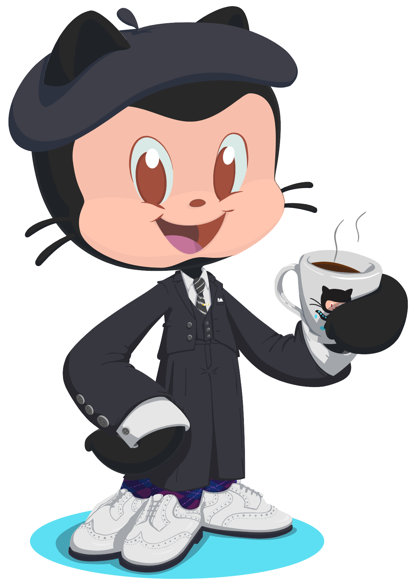

<!-- ## Hi there 👋 -->

<h1 align="left">Hi there, I'm Vijul Shah </h1>

Hello, my name is Vijul Shah and I am a master's student at RPTU Kaiserslautern, specializing in Intelligent Systems & Data Visualization and Scientific Computing.
Currently I'm working as a Machine Learning Engineer at Fraunhofer IAIS.  

With a background in Data Science, Deep Learning, and Full Stack Development, I possess a unique combination of Research and Software Engineering expertise. My passion lies in Research & Development and transforming it into engineering innovative solutions or products. Hence, I embody the skills and mindset of both an academic researcher and an engineer dedicated to developing robust industrial solutions.

 

  

    - 👉 Checkout my research: <a href="https://vijulshah.github.io/">HERE</a> 
    - 📫 How to reach me: <a href="mailto:vijul1904shah@gmail.com">vijul1904shah@gmail.com</a> 
    - 📝 Save my info: <a href="https://vijulshah.github.io/media/Vijul_Resume.pdf">Download Resume</a> 
    - ⚡ Fun fact: I love to paint 👨‍🎨 and I'm currently obsessed over cycling 🚴‍♂️ 
    - 💕 Like my Octocat? Create your own at <a href="https://myoctocat.com/">https://myoctocat.com/</a>  
  🔗 Connect With Me
  

    
    
    
    
  

    
  

<!--   -->

<!--  -->

## 💼 My Career
| From | To | Role | At | Location
|:------- |:--------|:----------------------------------------|:-----------------------------------------------------------------|:----------------|
| Dec 2022 | Current | Machine Learning Engineer |[Fraunhofer IAIS](https://www.iais.fraunhofer.de/) | [Sankt Augustin, Germany](https://g.co/kgs/hxXM6rx)
| April 2022 | Aug 2022 | Research Assistant |[DFKI](https://www.dfki.de/web/) | [Kaiserslautern, Germany](https://g.co/kgs/N6JHi2E)
| Oct 2021 | Dec 2024 | Masters in Computer Science |[RPTU](https://rptu.de/) | [Kaiserslautern, Germany](https://g.co/kgs/N6JHi2E)
| Aug 2020 | Sept 2021 | Full Stack Developer |[Bonds India](https://www.bondsindia.com/) | [New Delhi, India](https://g.co/kgs/kSk798v)
| Aug 2016 | Aug 2020 | Bachelors in Computer Engineering |[LDRP-ITR](https://www.ldrp.ac.in/) | [Gandhinagar, India](https://g.co/kgs/8gc6rHm)

## 💻 Programming Skills

<table>
  <tr>
    <td align="center" width="96">
      
       Python
    </td>
    <td align="center" width="96">
      
       JavaScript
    </td>
    <td align="center" width="96">
      
       Java
    </td>
    <td align="center" width="96">
      
       SQL
    </td>
    <td align="center" width="96">
      
       R
    </td>
    <td align="center" width="96">
      
       C
    </td>
    <td align="center" width="96">
      
       C++
    </td>
  </tr>
</table>

## 🛠️ Libraries / Frameworks

<table>
  <tr>
    <td align="center" width="96">
      
       PyTorch
    </td>
    <td align="center" width="96">
      
       OpenCV
    </td>
    <td align="center" width="96">
      
       Numpy
    </td>
    <td align="center" width="96">
      
       Pandas
    </td>
    <td align="center" width="96">
      
       Seaborn
    </td>
    <td align="center" width="96">
      
       Matplotlib
    </td>
    <td align="center" width="96">
      
       Streamlit
    </td>
  </tr>
  <tr>
    <td align="center" width="96">
      
       Pytorch-Lightning
    </td>
    <td align="center" width="96">
      
       Huggingface
    </td>
    <td align="center" width="96">
      
       Accelerate
    </td>
    <td align="center" width="96">
      
       Captum
    </td>
    <td align="center" width="96">
      
       SLURM
    </td>
    <td align="center" width="96">
      
       MLFlow
    </td>
    <td align="center" width="96">
      
       WnB
    </td>
  </tr>
  <tr>
    <td align="center" width="96">
      
       Git
    </td>
    <td align="center" width="96">
      
       React
    </td>
    <td align="center" width="96">
      
       Node JS
    </td>
    <td align="center" width="96">
      
       Flask
    </td>
    <td align="center" width="96">
      
       Firebase
    </td>
    <td align="center" width="96">
      
       Android
    </td>
    <td align="center" width="96">
      
       AWS
    </td>
  </tr>
</table>

## 🏹 Domain Skills

- **Computer Vision**: 
  - Object Detection
  - Image Segmentation
  - Image Classification
  - Regression
  - Image Super Resolution
  - Coreset Selection
  - Dataset Distillation, and much more...

- **NLP**: 
  - PEFT (Parameter Efficient Fine Tuning)
  - Q-LoRA (Quantization and Low Rank Apdaption)
  - Text Classification
  - Code Generation, and much more...

##  📊 Github Stats

<!--  -->

<!--
Here are some ideas to get you started:

- 🔭 I’m currently working on ...
- 🌱 I’m currently learning ...
- 👯 I’m looking to collaborate on ...
- 🤔 I’m looking for help with ...
- 💬 Ask me about ...
- 📫 How to reach me: ...
- 😄 Pronouns: ...
- ⚡ Fun fact: ...
-->
